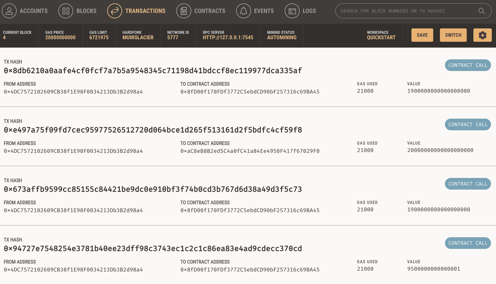

# Fintech Finder
### The following project is a simulation of a fintech finder, an application its customers can use to find fintech professionals from among a list of candidates. You can hire them and pay them.

# Requirements
### For the application to work, you must first download the following libraries;
- streamlit :`pip install streamlit`
- web3:`pip install web3==5.17`
- mnemonic: `pip install mnemonic`
- bip44: `pip install bip44`

# Running the Web interface
### Once you have installed and the libraries required, your next step is to go to your terminal, go to the folder where the code is located, and then type;
```
streamlit run fintech_finder.py
```

# Fintech Finder Application
## The following images display how the application works. On the first image, you have this user-friendly page with the name, Ethereum account address, rating, and hourly rate.


## As you can see, there is a customizable sidebar where you can select the person and the number of hours. Once selected, it will show the results below, giving you the option to submit the payment - "Send Transaction." Once the transaction is sent, the following will display;


## On my end that has the Ganache account, the following transactions will display;
